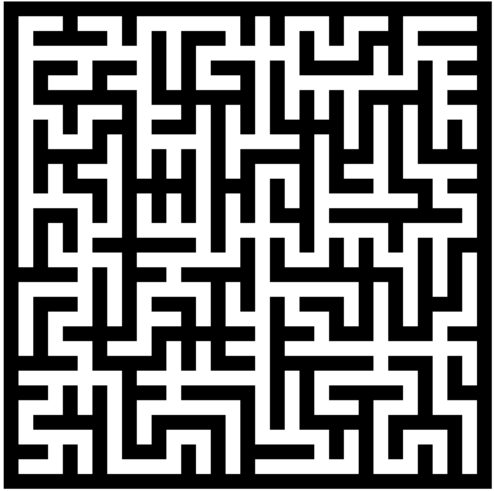

# Can Meet?

## Introduction

A maze is a path or collection of paths, typically from an entrance to a goal (Wikipedia). Tutu wants to check if a start point can reach the end point. But he is too lazy to use his eyes, so decides to make a program to solve the problem.

## Input

The first input will be _T_ meaning the total test case, and the next _T_ lines, the input will be _W_ and _H_ meaning the width and the height of the maze including the walls and then it will be followed by a *W*X*H* map. '#' meaning an obstacle, ' ' meaning a path, 'S' meaning the start point, and 'E' meaning the end point. The path is UP or DOWN or LEFT or RIGHT only.

## Output

For each test cases, the output will be "Case #_i_: " (_i_ is the current test case) and then follow by "YES" if start point can reach end point otherwise print "NO"

## Test Case

### Input

<pre>
3
5 5
#####
#S  #
#   #
#  E#
#####
10 10
##########
##      E#
#S#      #
#  #     #
#   #    #
#    #   #
#     #  #
#      # #
#        #
##########
10 10
##########
##      E#
#S#      #
#  #     #
#   #    #
#    #   #
#     #  #
#      # #
#       ##
##########
</pre>

|

### Output

<pre>
Case #1: YES
Case #2: YES
Case #3: NO
</pre>
